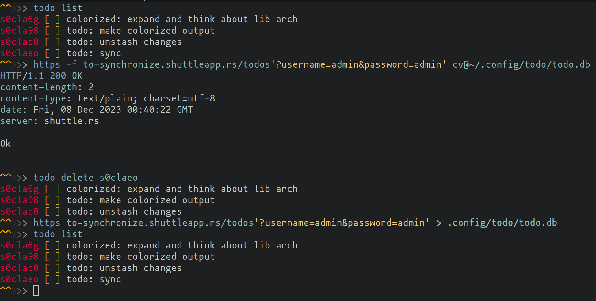

# To-Synchronize

Simple api for storing todos ([todo app](https://github.com/Surrphy/todo)).

Hosted [here](to-synchronize.shuttleapp.rs) 

## Usage

Usage examples using command-line http client.

 
